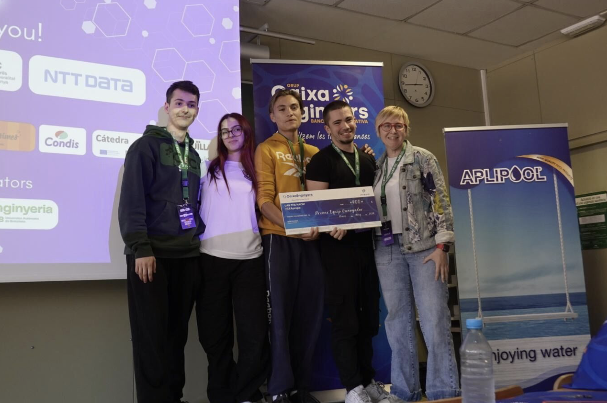
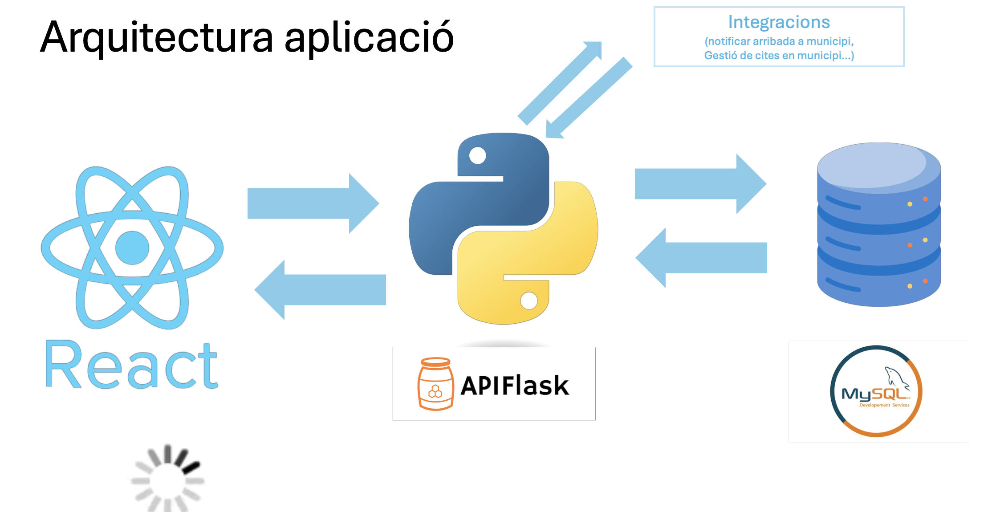
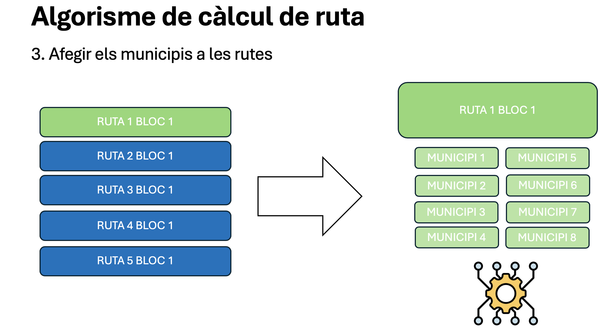
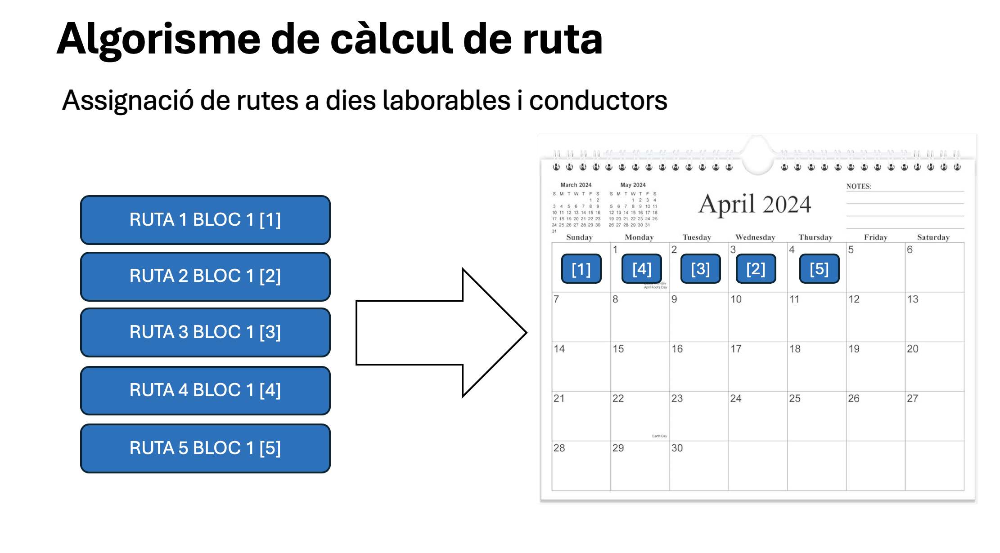
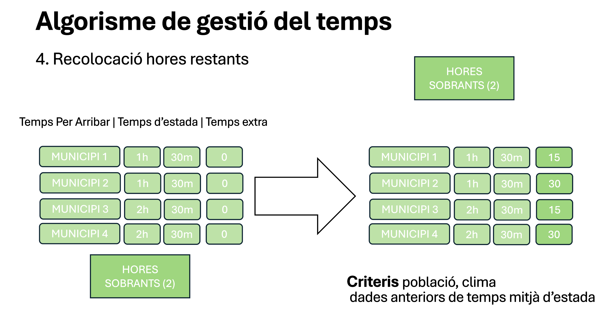
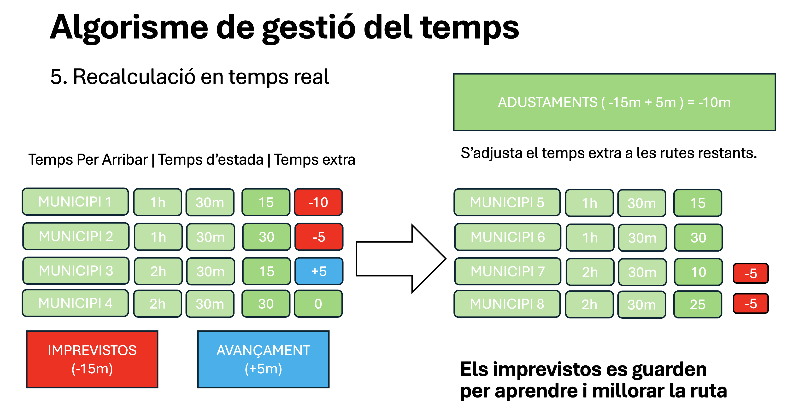

# README

Mikel Garzón: [](https://www.linkedin.com/in/mikel-garz%C3%B3n-gomes-483218296)

Sergi Jurez: [](https://www.linkedin.com/in/sergijuarez?utm_source=share\&utm_campaign=share_via\&utm_content=profile\&utm_medium=ios_app)

Marta Gimenez : [](https://www.linkedin.com/in/marta-gimenez-939b45292)

Pau Domínguez : [](https://www.linkedin.com/in/pau-dominguez-ruiz/)


<!-- PROJECT LOGO -->
<br />
<div align="center">
  <a href="https://www.linkedin.com/posts/mikel-garz%C3%B3n-gomes-483218296_hackataejn-innovaciaejn-trabajoenequipo-activity-7295794981770813440-uCI3?utm_source=share&utm_medium=member_desktop&rcm=ACoAAEeUQaMBwFAj6UrsN46YgSaQlYDZ5ogdpP4">
    
  </a>


<h4 align="center">Hackaton Caixa d'Eniginyers</h4>

Caixa D'Enginyers participó en la Hackathon de 2024 celebrada en la Universidad Autónoma de Barcelona, donde propusieron un reto para resolver un problema de algoritmosy rutas mediante el uso de tecnologías de la informática.

<details>

<summary>Table of Contents</summary>

1. [About The Project](./#about-the-project)
   * [Built With](./#built-with)
2. [Getting Started](./#getting-started)
   * [Prerequisites](./#prerequisites)
   * [Installation](./#installation)
3. [Usage](./#usage)
4. [Roadmap](./#roadmap)
5. [Contributing](./#contributing)
6. [License](./#license)
7. [Contact](./#contact)
8. [Acknowledgments](./#acknowledgments)

</details>

### About The Project

Este proyecto es una aplicación web basada en React que utiliza bibliotecas de Python para el procesamiento y análisis de datos. Proporciona una interfaz amigable para interactuar con los datos y visualizar los resultados. Antes de ejecutarlo, necesitas tener instalado Node.js y Python, así como las bibliotecas pandas, numpy, matplotlib, scikit-learn y de más. Este es un proyecto que tiene por objetivo cumplir con el reto propuesto por Caixa d'Enginyers. Tratamos de usar toda nuestra genialidad y originalidad en proponer ideas innovadoras que puedan gustar al cliente.

<p align="right">(<a href="./#readme-top">back to top</a>)</p>

#### Built With

* SQL
* JavaScript
* Python
* CSS
* HTML
* BASH
* [](https://reactjs.org/)

<p align="right">(<a href="./#readme-top">back to top</a>)</p>

#### Prerequisites

Before running this project, you will need to have the following installed on your machine:

* Node.js (version 12 or higher)
* Python (version 3.x)
* Python libraries:
  * pandas
  * numpy
  * matplotlib
  * scikit-learn

#### Installation

1. Clone repository:

```
git clone https://github.com/your-username/project-name.git
```

2. Navigate to the project directory:

```
cd project-name
```

3. Install the Node.js dependencies

```
npm install
```

<p align="right">(<a href="./#readme-top">back to top</a>)</p>

### Usage

1. Start the development server:

```
npm start
```

2. Open your web browser and navigate to http://localhost:3000 to view the application.
3. Interact with the data by selecting options from the dropdown menus and clicking the "Process Data" button.
4. View the visualizations of the processed data in the charts and tables below.

<p align="right">(<a href="./#readme-top">back to top</a>)</p>

#### Idea

     

### Contact

Mikel Garzón - - mikelagarzon@gmail.com&#x20;

Marta Gimenez Gonzalez - marta.gimenez.gonzalez1@gmail.com&#x20;

Pau Dominguez - p2004dr@gmail.com&#x20;

Sergi Juarez - sergijp22@gmail.com

Project Link: [Caixa d'enginyers](https://github.com/MkProgramer33/CaixaEnginyers)

<p align="right">(<a href="./#readme-top">back to top</a>)</p>
